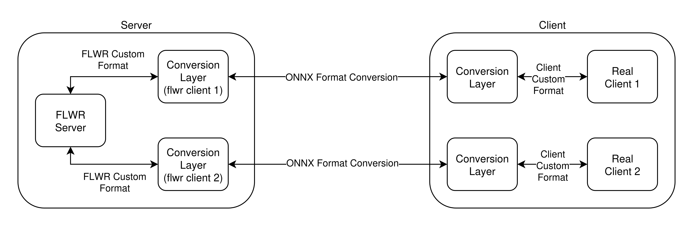

## Overview

This repository is based on the [Flower](https://github.com/adap/flower/tree/main/examples/embedded-devices) example and extends it to run a Federated Learning demo on embedded devices.

The main goal of this work is to use a well-established Federated Learning framework and perform **performance measurements** across a variety of devices. The demo has been tested on laptops (Linux), a Raspberry Pi 400, and a smartphone running Ubuntu Touch.

The main additions include performance-monitoring scripts and various fixes.

There are two main folders:

- **flwr_baremetal** - intended for environments where Flower is installed directly on the target machines.
- **flwr_docker** - intended for environments using Docker containers.

Inside the Docker folder, there is also a variant of the demo (in the `test_onnx` folder) that attempts to extend the Flower framework to support scenarios where clients cannot run Flower directly. The idea is that the Flower server communicates with *fake clients* running on the server, while these fake clients communicate with the real devices (on other machines) using the gRPC protocol.

## How to Run the Demo

For detailed instructions, refer to the `instructions.txt` file in the **baremetal** folder.

### Baremetal Version

1. Copy the performance script to the server.  
   Open a terminal in the same directory and run the Flower **SuperLink** command.

2. Copy the performance script to each client.  
   Open a terminal in the same directory and run the Flower **SuperNode** command  
   *(repeat for each client you want to include)*.

3. Navigate to the folder containing the `pyproject.toml` file and run Flower **run** command

### Docker Version

1. Run the following script: `./compose_with_privileges.sh`

2. Navigate to the folder containing the `pyproject.toml` file and run Flower **run** command

