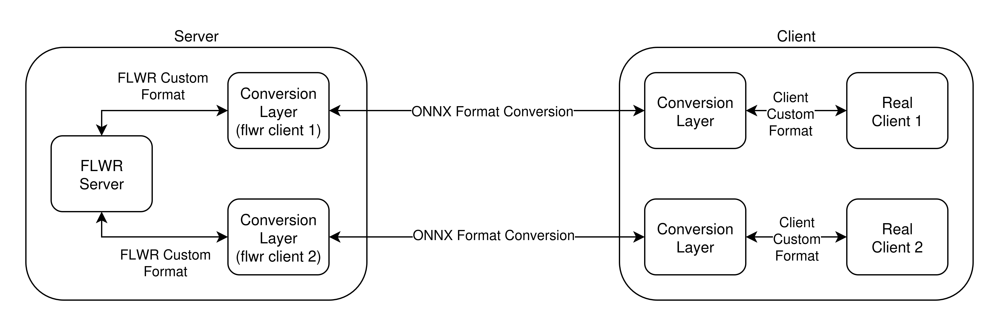
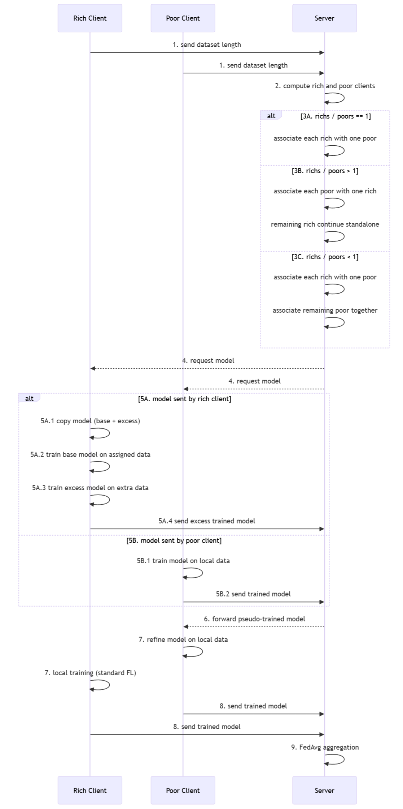

## Overview

This repository is based on this [Flower](https://github.com/adap/flower/tree/main/examples/embedded-devices) example and extends it to run a Federated Learning demo on embedded devices.

The main goal of this work is to use a well-established Federated Learning framework and execute **performance measurements** across a variety of devices. The demo has been tested on laptops (Linux Mint 22.1), a Raspberry Pi 400, and a smartphone running Ubuntu Touch.

The main additions include performance-monitoring scripts and various fixes.

There are two main folders:

- **flwr_baremetal** - intended for environments where Flower is installed directly on the target machines.
- **flwr_docker** - intended for environments using Docker containers.

Each section includes, within the `test` folder, a file for dataset generation (`generate_dataset.py`) that allows the user to specify the number of partitions and their proportions, either evenly divided or unbalanced.

Inside the Docker folder, there is also a variant of the demo (in `test_onnx`) that attempts to extend the Flower framework to support scenarios where clients cannot run Flower directly. The idea is that the Flower server communicates with *fake clients* running on the server, while these fake clients communicate with the real devices (on other machines) using the gRPC protocol.



There is also another folder in Docker section (`test_client_balancing`) that addresses an additional problem: balancing client contributions when some clients possess significantly larger datasets than others.

The idea is to employ a custom aggregation strategy that enables the server to identify “rich” and “poor” clients and pair them accordingly. Once the pairs are established, rich clients train a copy of the model using their surplus data and transmit it (via the server) to their paired poor clients. The poor clients then further train the model on their limited data and return the updated model to the server for aggregation. If the number of poor clients exceeds the number of rich clients, some poor clients may be paired with one another. In this case, a poor client first trains the model on its limited data and sends it to another poor client, which fine-tunes the model; this process is performed symmetrically so that both clients benefit from mutual adaptation.



Within the `server` directory of the containerized demo, two scripts are provided to perform **Member Inference Attacks (MIA)**, implementing two distinct methodologies:

- **Loss-Based Analysis**: A computationally efficient approach that analyzes the loss function to identify overfitting, which serves as an indicator that specific data points were used during training [1].
- **Shadow Model Approach**: A more sophisticated technique that utilizes a "shadow model" to identify complex patterns within the target model. This allows for a more precise determination of whether specific samples were part of the training set [2].

Finally, the `dockerized` environment includes scripts to generate a hybrid **sleep apnea dataset**. This dataset combines data from 10 real patients with a configurable number of virtual patients. While the simulated patients present a perfect ballistocardiogram with clearly identifiable apnea events, the inclusion of real patient data introduces realistic irregularity and noise, compensating for the small real-world sample size.

## How to Run the Demo

**NOTE**: To run the measurement scripts correctly, make sure you run the Flower commands as **administrator** as some tools require elevated privileges.

For detailed instructions, refer to the `instructions.txt` file in the **baremetal** folder.

### Baremetal Version

1. Generate dataset partitions and copy them to the corresponding clients.

2. Copy the performance script to the server. Open a terminal in the same directory and run the Flower **SuperLink** command.

3. Copy the performance script to each client. Open a terminal in the same directory and run the Flower **SuperNode** command *(repeat for each client you want to include)*.

4. Navigate to the folder containing the `pyproject.toml` file and execute Flower **run** command.
   
### Docker Version

1. Generate dataset partitions and copy them to the corresponding clients folder.

2. Run the following script: `compose_with_privileges.sh`.

3. Navigate to the folder containing the `pyproject.toml` file and execute Flower **run** command.

### ONNX Version

1. Generate dataset partitions and copy them to the corresponding clients.

2. Change project.toml as follow:

```toml
[tool.flwr.app.components]
serverapp = "test_onnx.server_side.server_app:app"
clientapp = "test_onnx.server_side.client_app:app"
```

3. Start `real_client.py` in `client_side` folder.

4. In `server_side/client_app` edit `ip_address` with real client address. 

5. Run `compose_with_privileges.sh`.

### Clients Balancing Version

1. Change project.toml as follow:

```toml
[tool.flwr.app.components]
serverapp = "test_client_balancing.server_app:app"
clientapp = "test_client_balancing.client_app:app"
```

2. Follow the same steps as [Docker Version](#docker-version)

### Member Inference Attack

1. Generate the MIA dataset using the provided script and copy it to the server folder.

2. Go to the server folder and choose which of the two variants to run (remember to execute the demo to create and save a model to attack)

### Changing datasets

Before running the application, you must generate your chosen dataset:

- F-MNIST:
    - Run `generate_dataset.py` in the `mnist_dataset` directory and specify the number of partitions and their split ratios.
    - Place the generated partitions into the client directories.
    - For Docker usage, update the dataset partition filename in `docker compose` file.
- Apnea:
    - Run the `apnea_dataset.py` script located in the `apnea_dataset` directory.
    - Run `windows_overlap.py` to generate windows defining apnea events.
    - Run `dataset_split.py` to create the partitions.
    - Place the partitions into the client directories.
    - For Docker usage, update the dataset partition filename in `docker compose` file.

To switch datasets, update the imports in both `server_app.py` and `client_app.py` to point to the correct task file (use `task_apnea.py` or `task_mnist.py`).

#### References

[1] S. Yeom, I. Giacomelli, M. Fredrikson, and S. Jha. **"Privacy Risk in Machine Learning: Analyzing the Connection to Overfitting."** *arXiv preprint arXiv:1709.01604*, 2018. [Available at: https://arxiv.org/abs/1709.01604](https://arxiv.org/abs/1709.01604)

[2] R. Shokri, M. Stronati, C. Song, and V. Shmatikov. **"Membership Inference Attacks against Machine Learning Models."** *arXiv preprint arXiv:1610.05820*, 2017. [Available at: https://arxiv.org/abs/1610.05820](https://arxiv.org/abs/1610.05820)
